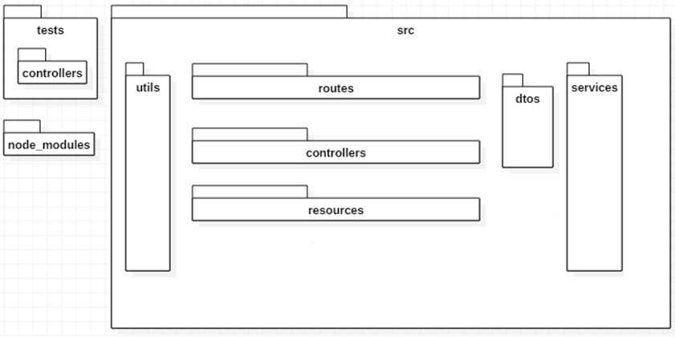

# Coding Challenge

### Deployed in Heroku: [https://.herokuapp.com](https://sara-backend.herokuapp.com)
### Status server in [https://.herokuapp.com/status](https://sara-backend.herokuapp.com/status)

### App Architecture:

